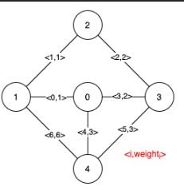
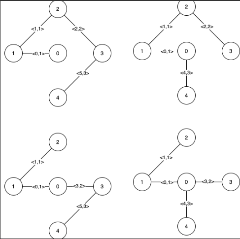
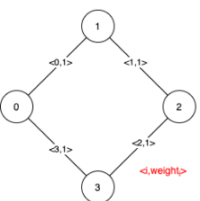

# LeetCode Problems

## Sumário
1. [#881. Boats to Save People](#881-boats-to-save-people-) 

2. [#630. Course Schedule III](#630-course-schedule-iii-)

3. [#1489. Find Critical and Pseudo-Critical Edges in Minimum Spanning Tree](#1489-find-critical-and-pseudo-critical-edges-in-minimum-spanning-tree-)

## #881. Boats to Save People 🔶
You are given an array people where people[i] is the weight of the ith person, and an infinite number of boats where each boat can carry a maximum weight of limit. Each boat carries at most two people at the same time, provided the sum of the weight of those people is at most limit.

Return the minimum number of boats to carry every given person.

Example 1:

Input: people = [1,2], limit = 3

Output: 1

Explanation: 1 boat (1, 2)

Example 2:

Input: people = [3,2,2,1], limit = 3

Output: 3

Explanation: 3 boats (1, 2), (2) and (3)

Example 3:

Input: people = [3,5,3,4], limit = 5

Output: 4

Explanation: 4 boats (3), (3), (4), (5)

## Como resolvemos?
Esse exercício foi bem tranquilo de resolver com a estratégia de algoritmos ambiciosos. Como sempre, precisamos ordenar o vetor, ordenamos por peso, do menor para o maior, e a ideia era smepre tentar colocar alguém com menor peso com alguém de maior peso no mesmo barco, isso se não extrapolasse o limite.

Foi um código bem simples de ser implementado, bastou ter a ideia. E a lógica no código é colocar dois ponteiros, um na ponta da esquerda e outro na direita, e enquanto o ponteiro da esquerda for menor ou igual ao da direita, iteramos. Para cada iteração víamos se cabe um de maior peso com um de menor, se sim, eu incremento o ponteiro da esquerda, se não, apenas decremento o ponteiro da direita, isso significa que o mais pesado precisou de um barco só pra ele. E o número de barcos sempre vai incrementando a cada iteração.

## #630. Course Schedule III 🔴
There are n different online courses numbered from 1 to n. You are given an array courses where courses[i] = [durationi, lastDayi] indicate that the ith course should be taken continuously for durationi days and must be finished before or on lastDayi.

You will start on the 1st day and you cannot take two or more courses simultaneously.

Return the maximum number of courses that you can take.

Exemple 1:

Input: courses = [[100,200],[200,1300],[1000,1250],[2000,3200]]

Output: 3

Explanation: 
There are totally 4 courses, but you can take 3 courses at most:
First, take the 1st course, it costs 100 days so you will finish it on the 100th day, and ready to take the next course on the 101st day.
Second, take the 3rd course, it costs 1000 days so you will finish it on the 1100th day, and ready to take the next course on the 1101st day. 
Third, take the 2nd course, it costs 200 days so you will finish it on the 1300th day. 
The 4th course cannot be taken now, since you will finish it on the 3300th day, which exceeds the closed date.

Example 2:

Input: courses = [[1,2]]

Output: 1

Example 3:

Input: courses = [[3,2],[4,3]]

Output: 0

## Como resolvemos?
...

## #1489. Find Critical and Pseudo-Critical Edges in Minimum Spanning Tree 🔴

Given a weighted undirected connected graph with n vertices numbered from 0 to n - 1, and an array edges where edges[i] = [ai, bi, weighti] represents a bidirectional and weighted edge between nodes ai and bi. A minimum spanning tree (MST) is a subset of the graph's edges that connects all vertices without cycles and with the minimum possible total edge weight.

Find all the critical and pseudo-critical edges in the given graph's minimum spanning tree (MST). An MST edge whose deletion from the graph would cause the MST weight to increase is called a critical edge. On the other hand, a pseudo-critical edge is that which can appear in some MSTs but not all.

Note that you can return the indices of the edges in any order.

Exemple 1:

Input: n = 5, edges = [[0,1,1],[1,2,1],[2,3,2],[0,3,2],[0,4,3],[3,4,3],[1,4,6]]

Output: [[0,1],[2,3,4,5]]

Explanation: The figure above describes the graph.
The following figure shows all the possible MSTs:

Notice that the two edges 0 and 1 appear in all MSTs, therefore they are critical edges, so we return them in the first list of the output.
The edges 2, 3, 4, and 5 are only part of some MSTs, therefore they are considered pseudo-critical edges. We add them to the second list of the output.

Example 2:

Input: n = 4, edges = [[0,1,1],[1,2,1],[2,3,1],[0,3,1]]

Output: [[],[0,1,2,3]]

Explanation: We can observe that since all 4 edges have equal weight, choosing any 3 edges from the given 4 will yield an MST. Therefore all 4 edges are pseudo-critical.

## Como resolvemos?

Nesse problema, vimos que era necessário apenas comparar os pesos das MSTs, e para cada aresta do grafo, ver se ela aumentava o peso da MST ou não, assim seria crítica, tendo que estar em todas as MSTs; se não, pseudo-crítica, normalmente quando empatava os pesos de duas arestas.

A ideia era bem simples, então apenas precisávamos de um algoritmo que "gerasse" uma MST, entre aspas porque estávamos interessados apenas nos pesos mesmo, e o Prim conseguiria fazer isso. Porém o tema do módulo era Greedy, e ficamos muito curiosos com a estrutura de dados Union-Find, então decidimos usar Kruskal.

Foi um desafio implementar essa estrutura, mas depois de ver uns vídeos na internet, entendemos como ela funcionava, e era relativamente simples. Depois de ter feito, bastou fazer umas modificações no algoritmo do Kruskal, para retornar apenas o peso da MST, e fazer uma forma de tirar uma aresta, sempre que fosse calcular esse peso.