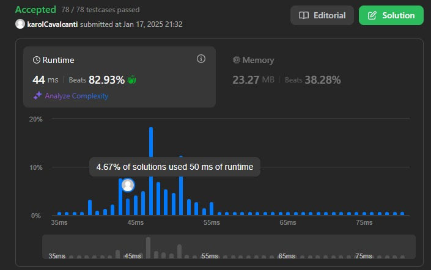
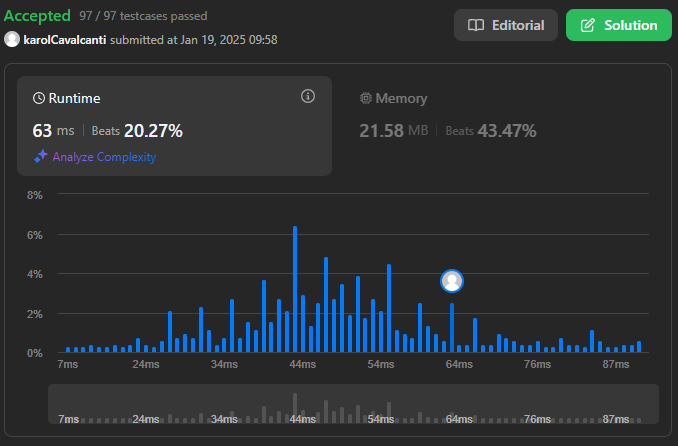
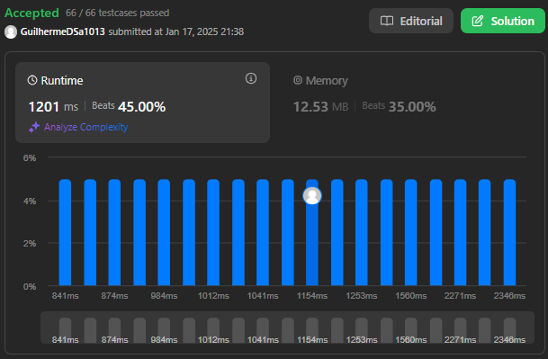

# LeetCode Problems

**Número da Lista**: 26 
**Conteúdo da Disciplina**: Greed 

## Alunos
|Matrícula | Aluno |
| -- | -- |
| 211031575  |  Ana Karoliny de Souza Cavalcanti |
| 211031056  |  Guilherme de Sá Gonçalves |

## Sobre 
Esse projeto tem como objetivo armazenar as resoluções feitas dos seguintes exercícios do LeetCode:

- (Medium) - [#881. Boats to Save People](https://leetcode.com/problems/boats-to-save-people/description/)
- (Hard) - [#630. Course Schedule III](https://leetcode.com/problems/course-schedule-iii/description/)
- (Hard) - [#1489. Find Critical and Pseudo-Critical Edges in Minimum Spanning Tree](https://leetcode.com/problems/find-critical-and-pseudo-critical-edges-in-minimum-spanning-tree/submissions/1511987226/)

## Screenshots

#881. Boats to Save People

#630. Course Schedule III

#1489. Find Critical and Pseudo-Critical Edges in Minimum Spanning Tree

## Instalação 
**Linguagem**: Python3 

No caso, basta fazer uma conta no LeetCode, e ir no problema e copiar o código na resolução e testar. 

## Uso 
Porém caso não queira testar pelo LeetCode, basta clonar o repositório e rodar o arquivo com o nome do número do exercício, foram setados os mesmos exemplos de inputs que constam na descrição do problema.

## Outros 
Copiamos os problemas para o repositório, caso não queria abrir o LeetCode e queira ler a descrição do problema, clique [AQUI!!!](Problems.md)

## Vídeos
